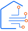

# Ecommerce

[![MIT License][license-shield]][license-url]
[![LinkedIn][linkedin-shield]][linkedin-url]

<br />
<div align="center">
  <a href="https://ecommerce-frontend.up.railway.app">
		
  </a>

  <p align="center">
  Ecommerce is a pet project that I created to learn new technologies and improve my skills. Specifically, I wanted to learn how to use Sanity.io as a headless CMS, how to use GraphQL with React, and refresh my knowledge of Redux Toolkit.
    <br />
    <br />
    <a href="https://ecommerce-frontend.up.railway.app">View Site</a>
    ·
    <a href="https://github.com/v-mokhun/ecommerce-frontend/issues">Report Bug</a>
    ·
    <a href="https://github.com/v-mokhun/ecommerce-frontend/issues">Request Feature</a>
  </p>
</div>

<details>
  <summary>Table of Contents</summary>
  <ol>
    <li>
      <a href="#about-the-project">About The Project</a>
      <ul>
        <li><a href="#built-with">Built With</a></li>
        <li><a href="#challenges">Challenges</a></li>
      </ul>
    </li>
    <li>
      <a href="#getting-started">Getting Started</a>
      <ul>
        <li><a href="#running-the-app">Running the App</a></li>
        <li><a href="#environment-variables">Environment Variables</a></li>
      </ul>
    </li>
    <li><a href="#contributing">Contributing</a></li>
    <li><a href="#license">License</a></li>
    <li><a href="#contact">Contact</a></li>
  </ol>
</details>

## About The Project

[![Home Screenshot][home]](https://ecommerce-frontend.up.railway.app)

This project is a simple ecommerce website that allows users to browse products, add them to cart, and checkout. It is built with React.js and Sanity.io as a headless CMS. It uses GraphQL to query data from Sanity.io. It also uses Redux Toolkit for state management and Stripe for payments.

There is also a blog, which is built with Sanity.io and GraphQL. It allows users to read blog posts and admins to create, edit, and delete blog posts.

The website is fully responsive and works on all screen sizes.

<p align="right">(<a href="#ecommerce">back to top</a>)</p>

### Built With

- [![React.js][React.js]][React-url] as a Frontend Framework

- [![TypeScript][TypeScript.org]][TypeScript-url] For Type Safety

- [![Sanity.io][Sanity.io]][Sanity-url] As a Headless CMS

- [![Redux-Toolkit][Redux-Toolkit]][Redux-Toolkit-url] For State Management

- [![GraphQL][GraphQL]][GraphQL-url] For API Queries

- [![ReactHookForm][ReactHookForm.com]][ReactHookForm-url] For Form Handling

- [![Zod][Zod.dev]][Zod-url] For Form Validation

- [![TailwindCSS][TailwindCSS.com]][TailwindCSS-url] With [![RadixUI][RadixUI.com]][RadixUI-url] For UI Components

<p align="right">(<a href="#ecommerce">back to top</a>)</p>

### Challenges

- **Sanity.io** - I have never used Sanity.io before, so I had to learn how to use it as well as integrating headless CMS with React application. I also had to learn how to use GraphQL with Sanity as it has some specific syntax.
- **GraphQL** - I have never used GraphQL before, so I had to learn how to use it with React. It wasn't too difficult as I already knew how API work. In the end, I decided to use [Apollo Client](https://www.apollographql.com/docs/react/) and a GraphQL codegen plugin for generating types from GraphQL queries.

<p align="right">(<a href="#ecommerce">back to top</a>)</p>

## Getting Started

To get a local copy up and running follow these simple example steps.

### Running the app

1. Clone the repo
   ```sh
   git clone https://github.com/v-mokhun/ecommerce-frontend.git .
   ```
2. Install NPM packages
   ```sh
   npm install
   ```
3. Run the app (Will not work without environment variables)
   ```sh
   npm run dev
   ```

### Environment Variables

1. Create a .env file in the root of the project and copy all contents from .env.example file.
2. Register an account on [Sanity.io](https://www.sanity.io/) and create a new project. You can use the free plan. Then insert api url into VITE_API_URL variable.
3. Register an account on [Stripe.com](https://stripe.com/) and create a new project. You can use the free plan. Then insert public key into VITE_STRIPE_PUBLISHABLE_KEY variable.

<p align="right">(<a href="#ecommerce">back to top</a>)</p>

## Contributing

Contributions are what make the open source community such an amazing place to learn, inspire, and create. Any contributions you make are **greatly appreciated**.

If you have a suggestion that would make this better, please fork the repo and create a pull request. You can also simply open an issue with the tag "enhancement".
Don't forget to give the project a star! Thanks again!

1. Fork the Project
2. Create your Feature Branch (`git checkout -b feature/AmazingFeature`)
3. Commit your Changes (`git commit -m 'Add some AmazingFeature'`)
4. Push to the Branch (`git push origin feature/AmazingFeature`)
5. Open a Pull Request

<p align="right">(<a href="#ecommerce">back to top</a>)</p>

## License

Distributed under the MIT License. See `LICENSE.txt` for more information.

<p align="right">(<a href="#ecommerce">back to top</a>)</p>

## Contact

[Telegram](https://t.me/v_mokhun)

[LinkedIn](https://www.linkedin.com/in/volodymyr-mokhun-35005723b/)

Project Link: [https://ecommerce-frontend.up.railway.app](https://ecommerce-frontend.up.railway.app)

<p align="right">(<a href="#ecommerce">back to top</a>)</p>

[license-shield]: https://img.shields.io/github/license/v-mokhun/ecommerce-frontend.svg?style=for-the-badge
[license-url]: https://github.com/v-mokhun/ecommerce-frontend/blob/master/LICENSE.txt
[linkedin-shield]: https://img.shields.io/badge/-LinkedIn-black.svg?style=for-the-badge&logo=linkedin&colorB=555
[linkedin-url]: https://www.linkedin.com/in/volodymyr-mokhun/
[home]: readme-images/home.jpg
[React.js]: https://img.shields.io/badge/-ReactJs-61DAFB?logo=react&logoColor=white&style=for-the-badge
[React-url]: https://reactjs.org/
[Sanity.io]: https://img.shields.io/badge/-Sanity.io-000000?logo=Sanity&logoColor=white&style=for-the-badge
[Sanity-url]: https://www.sanity.io/
[Redux-Toolkit]: https://img.shields.io/badge/-Redux_Toolkit-764ABC?logo=Redux&logoColor=white&style=for-the-badge
[Redux-Toolkit-url]: https://redux-toolkit.js.org/
[GraphQL]: https://img.shields.io/badge/-GraphQL-E10098?logo=GraphQL&logoColor=white&style=for-the-badge
[GraphQL-url]: https://graphql.org/
[ReactHookForm.com]: https://img.shields.io/badge/React%20Hook%20Form-%23EC5990.svg?style=for-the-badge&logo=reacthookform&logoColor=white
[ReactHookForm-url]: https://react-hook-form.com/
[TailwindCSS.com]: https://img.shields.io/badge/tailwindcss-%2338B2AC.svg?style=for-the-badge&logo=tailwind-css&logoColor=white
[TailwindCSS-url]: https://tailwindcss.com/
[TypeScript.org]: https://img.shields.io/badge/typescript-%23007ACC.svg?style=for-the-badge&logo=typescript&logoColor=white
[TypeScript-url]: https://www.typescriptlang.org/
[RadixUI.com]: https://img.shields.io/static/v1?style=for-the-badge&message=Radix+UI&color=161618&logo=Radix+UI&logoColor=FFFFFF&label=
[RadixUI-url]: https://www.radix-ui.com/
[Zod.dev]: https://img.shields.io/static/v1?style=for-the-badge&message=Zod&color=3E67B1&logo=Zod&logoColor=FFFFFF&label=
[Zod-url]: https://zod.dev/
